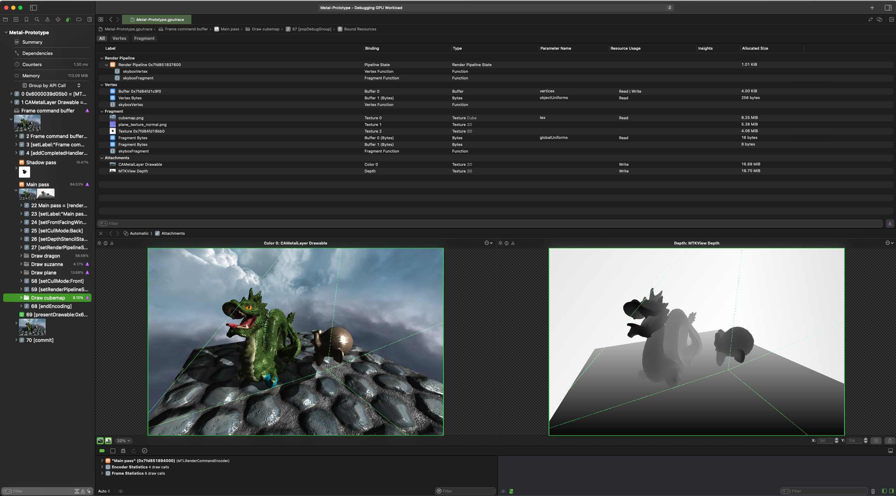

# Metal Prototype

#

Metal is a graphics API developed by Apple for the iOS and macOS platforms. It offers an object-oriented interface to interact with the GPU in an asynchronous manner. 

One key feature is the upfront validation of rendering commands before execution. This approach allows for the accumulation of rendering commands in a buffer, enabling concatenation, simplification, and reordering of commands. 

Metal is designed to provide high-performance graphics and compute capabilities for applications, particularly in scenarios where fine control over GPU resources and parallel processing is essential.

#

*Visualizing the rendering passes and the data on the GPU with the Metal debugger.*

